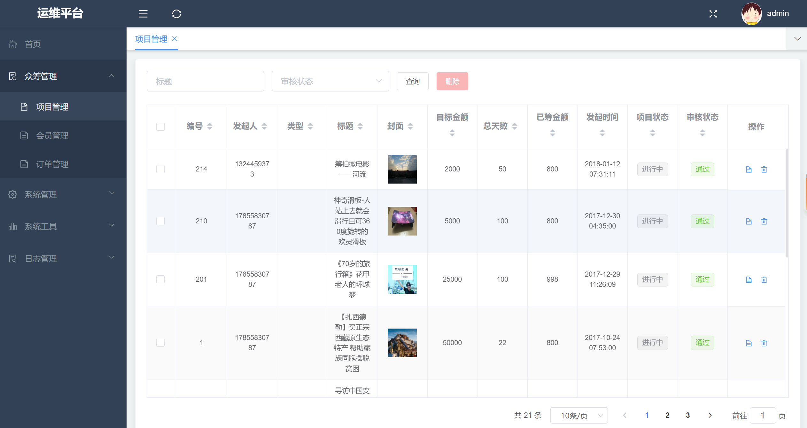

## 系统说明

- 基于 Spring Boot + Vue + Jwt 开发的 **众筹平台系统**
- 轻量级 + 组件化 + 可扩展

## 程序预览

### 前台


### 后台



[详情预览](doc/detail.md)

## 快速开始

### 核心依赖

| 依赖                          | 版本                                                   |
|-----------------------------|------------------------------------------------------|
| Spring Boot                 | 2.6.3                                                |
| yeee-memo                   | [通用web脚手架](https://github.com/yeeevip/yeee-memo.git) |

### 模块说明

```lua
yeee-crowdfunding
├── app-h5
    ├── yeee-admin-ui -- 众筹后台管理系统｜vue
    └── yeee-crowdfunding-web -- 众筹前台页面
├── doc -- 文档脚本
├── yeee-crowdfunding-bootstrap -- 主启动工程
├── yeee-crowdfunding-client -- 众筹客户端服务
├── yeee-app-common -- 公共模块
├── yeee-crowdfunding-manage -- 众筹管理端服务
├── yeee-sys-manage -- 系统权限管理服务
```

### 本地开发 运行

#### 环境要求

- jdk1.8
- mysql >= 5.7
- redis

```
# 下载yeee-memo工程
git clone https://github.com/yeeevip/yeee-memo.git

# 打包依赖[通用JavaWeb脚手架]memo-parent
cd memo-parent && mvn clean install

# 下载众筹项目
git clone https://github.com/yeeevip/yeee-crowdfunding.git

# 运行web服务
mvn clean install && java -jar -Dspring.profiles.active=test yeee-crowdfunding-bootstrap/target/yeee-crowdfunding-bootstrap-1.0.0-SNAPSHOT.jar

# 运行众筹管理端ui
cd app-h5/yeee-admin-ui && npm install && npm run dev

```

### 其他说明

1. 欢迎提交 [PR](https://www.yeee.vip)，注意对应提交对应 `crowdfunding-dev` 分支

2. 欢迎提交 [issue](https://github.com/yeeevip/yeee-crowdfunding/issues)，请写清楚遇到问题的原因、开发环境、复显步骤。

## 技术交流群

作者QQ：1324459373
